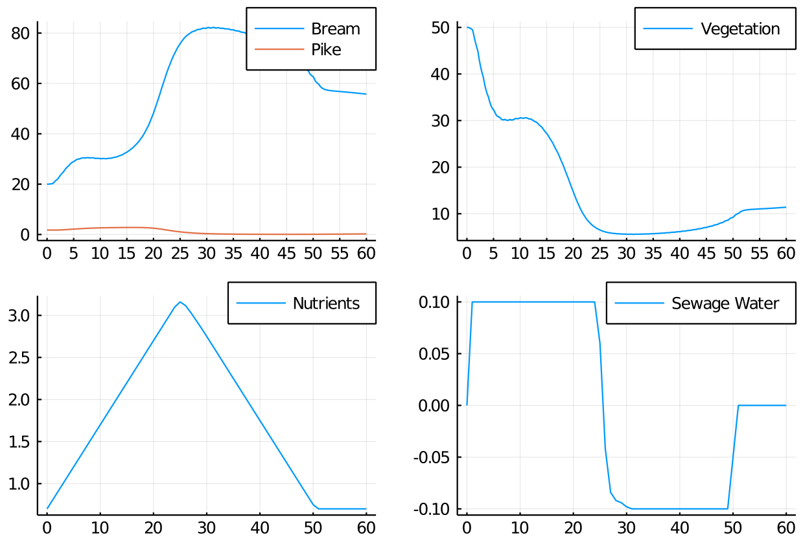
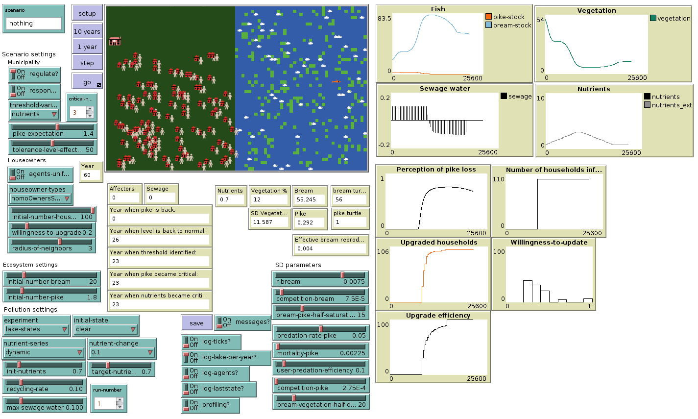

# LimnoSES.jl
A limnological social-ecological system hybrid.

This branch (Martin2015) serves as a legacy component in the model that mimics the Netlogo implementation from Martin 2015 by default, although under the hood it has the capacity to be extended to the modern version (it is branched off from master at 53864b1).

## Example initialisation

```julia
using LimnoSES
using Plots

model = initialise(
    experiment = Experiment(identifier = "Martin2015",
                            nutrient_series = Dynamic(),
                            ),
    lake_state = lake_initial_state(Clear),
    municipalities = Dict(
        "main" => (
            Governance(
                houseowner_type = Social(),
                regulate = true,
                respond_direct = false,
                interventions = [WastewaterTreatment()],
                # interventions = [],
            ),
            100,
        ),
    ),
)

nutrients(model) = model.lake.p.nutrients

_, data = run!(model, agent_step!, model_step!, 60; mdata = [sewage_water, nutrients])

discrete = model.lake.sol(0:12:365*60)

hs = plot(discrete; labels=["Bream" "Pike"], xticks=(0:365*5:365*60, 0:5:60))

veg = vegetation(discrete[1,:], model.lake.p) # Get vegetation from discretised bream population
hv = plot(discrete.t, veg; label="Vegetation", xticks=(0:365*5:365*60, 0:5:60))

hn = plot(data.step, data.nutrients; label="Nutrients")
hsw = plot(data.step, data.sewage_water; label="Sewage Water")

plot(hs,hv,hn,hsw;layout=(2,2))
```



Compare the same initialisation to the Netlogo version:



## Installing this version from scratch

Assuming Julia is installed and you're a first time user, this is one way to get everything ready.

1. Make a directory for your project, `cd` into it and start the `julia` REPL
2. Type `]` to get into the configuration mode, then `activate .` to tell julia to use the current directory for your settings
3. Type `add Plots` and wait for julia to complete the installation
4. Type `add https://github.com/Libbum/LimnoSES.jl#Martin2015`
5. Once this action has completed, press escape to get back to the main prompt

From this point, any script (like the one above) will work for you, so long as you do the `] activate .` step when you start the julia REPL from the project directory we created.
